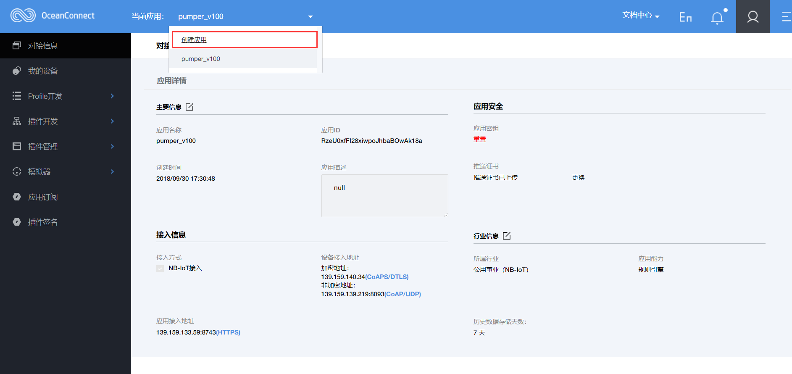
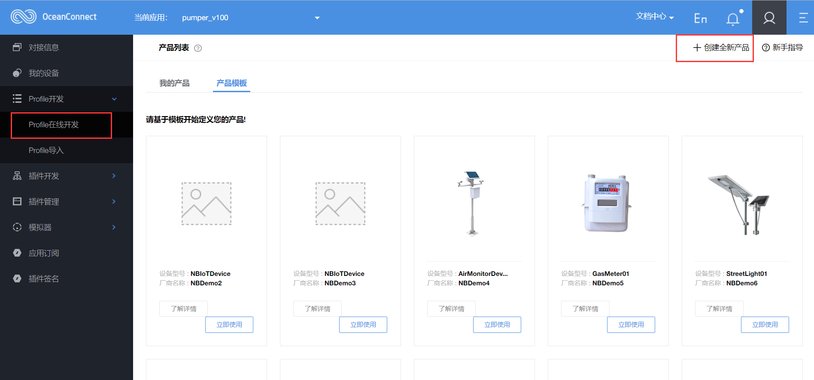
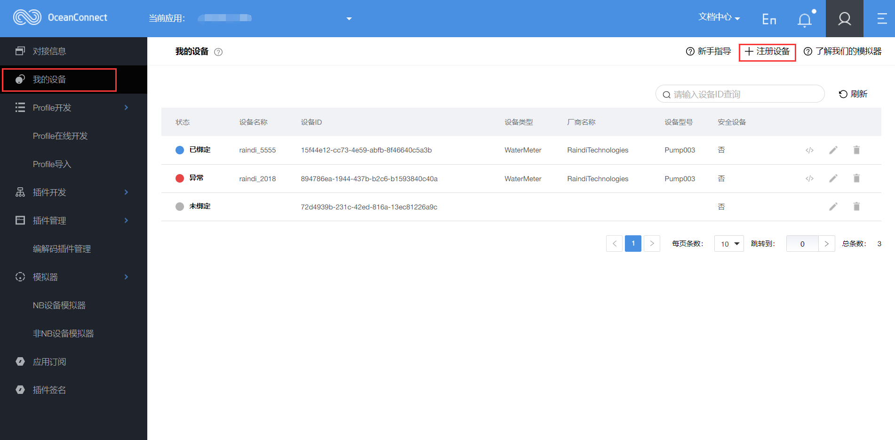
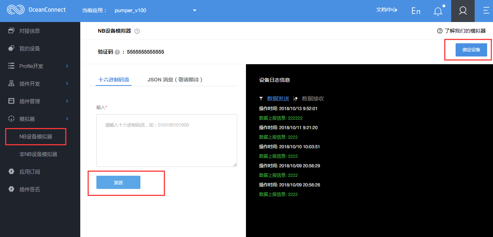
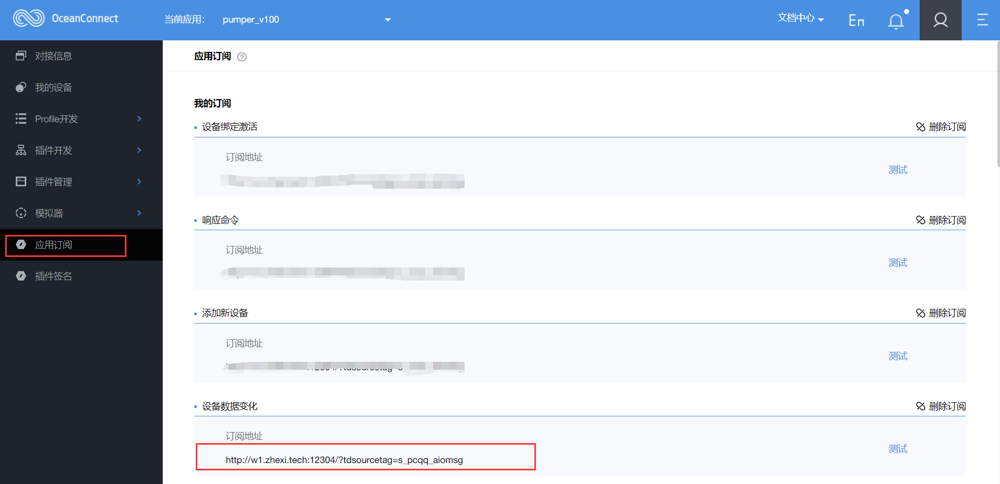
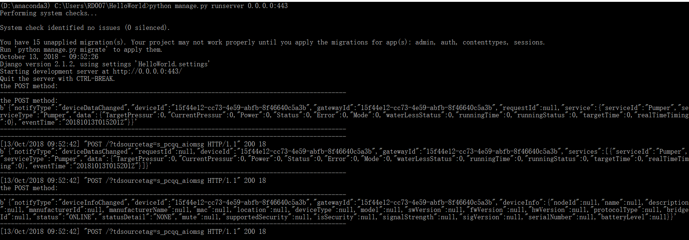

# NB-iot 开发

本文主要是写如何使用实现NB-IOT模组链接NB-IOT平台，实现数据的上传和下发，并且如何实现订阅。也就是说获取到传感器的数据后，通过NB-IOT模块把数据发送到电信的NB-IOT平台或者华为的**OceanConnect**，然后把消息发送到服务器。实现的过程如下。

## 1 名词解释

**名词解释：**

**南向设备**：开发者自行开发的终端硬件设备（包含多个传感器和MCU）。

**北向应用**：开发者自行开发的服务端应用（基于华为OceanConnect物联网平台提供的RESTful接口）。

**NB-IoT**：窄带物联网，华为等公司主推的物联网通讯用蜂巢网络。

**NB芯片/模组**：类似于3G/4G通信模组，将设备端数据打包发送到指定平台的硬件模块。

**SoftRadio**：用于模拟NB模组、基站、核心网的PC端软件，可用于在缺乏NB模组和NB实网环境时的设备对接调试。
**OceanConnect**：华为物联网全联接平台，南向设备和北向应用通过该平台交换数据和信令。

**设备Profile文件**：描述设备“是什么”、“能干什么”的json格式文件，上传到OceanConnect平台（上传时是zip包格式），设备绑定平台和提供服务的关键配置文件。

**编解码插件**：用来对NB设备上报的数据进行解码，同时对下发给NB设备的信令进行编码的插件，对接前需上传到OceanConnect平台。

**转载**：[心得分享】NB-IoT对接方案——（1）相关名词解释 和 基本业务流程简介](https://developer.huawei.com/ict/forum/thread-19045.html)

## 2 设备接入 与 数据上报

### 2.1通过SP Portal在平台上创建“应用”，获得appid和secret

SP Portal是OceanConnect物联网平台呈现给开发者使用的前台界面，可以完成一些基本的应用管理、设备管理（直接添加设备无效）、数据查看、信令查看等功能。
开发者首先需要登录SP Portal（账户名、密码会随着平台资源一同下发），创建一个“应用”。
这个“应用”可以理解成开发者的北向应用在平台的一个映射。
应用创建完成后，平台会返回appid和secret。开发者需要妥善保存好这两个值。

如图所示：直接在OceanConnect上创建应用

### 2.2 设备Profile：完成开发，并上传到平台

设备Profile文件定义了设备的基本信息和服务能力，只有上传了设备Profile文件，才能正确的绑定设备，接收数据，发送信令。

如图所示：直接在OceanConnect上创建profile文件。

### 2.3 北向应用：首先实现鉴权、注册直连设备、修改设备信息

根据华为提供的文档、Lite Demo示例、图形化Demo示例等资源，进行北向应用的开发。
为了南北对接联调，应该首先完成以下3个功能接口：鉴权、注册直连设备、设置设备信息。
完成了上述3个功能接口后，将可以在平台上创建一个离线设备。
可以通过SP Portal查看设备是否创建成功，设备各项信息是否设置完整正确。

如图所示，在SP Portal上注册设备。

### 2.4 编解码器：完成开发，并上传到平台

编解码器要实现2个主要接口（解码与编码），承担4个任务：

- 对上报的数据进行解码；
- 对上报的信令响应进行解码；
- 对下发的信令进行编码；
- 对下发的数据响应进行编码；

在SP Portal上创建编解码插件，如图所示。

### 2.5 南向设备：发起绑定请求

在SP Portal上能查看到一个离线设备后，且设备的各项信息完整正确，profile和对应的编解码插件都已上传，此时可以开始南向设备的绑定操作。

- 方法一：使用SoftRadio进行模拟NB模块、基站、NB核心网，通过图形化界面进行绑定；（详见SoftRadio使用指南）
- 方法二：直接使用NB模块（在有NB实网的情况下），通过配置平台信息和发送数据，完成设备的绑定。（详见相应模块的AT命令手册）
- 方法三：直接在SP Portal使用模拟器进行设备绑定。

设备绑定成功后，可以从SP Portal上看到设备状态从未绑定变成已绑定。现在使用方法三进行设备绑定，如图所示：选择NB设备模拟器，然后选择绑定数据，接着输入设备标识码，就可以完成绑定。

### 2.6 南向设备：发送数据

南向设备使用AT+NMGS命令，通过串口，向NB模块或者SoftRadio发送数据。

数据的发送格式务必和编解码插件中的定义匹配。

数据如果发送成功，可以在SP Portal的设备event一栏看到相关的内容，当没有进行绑定时，发送数据发送成功后在nb-iot平台上的设备状态会由未绑定状变成已绑定状态。

如果event内没有内容，则数据上传失败，具体原因需要结合实际情况进行分析，可在【自调试】系列中查找答案。 

## 3 消息订阅

消息订阅也是nb-iot开发的重要部分，主要是为了获取设备消息，设备改变等，比如设备的消息有更新的时候，在NB-IOT就会根据我们订阅的地址用http的post方式发送到我们订阅的地址。如图所示，在SP Portal进行消息订阅，这里我填入了我服务器的地址，当有消息变化时候，NB-IOT平台就会发送数据到这个地址上，我们就可以获取这些数据。

在这里我使用了Django搭建了一个服务器，用于测试是否订阅成功（对于Django服务器搭建的过程后面再另写一篇）。这时我打开服务器，并发送了一些数据，这时在服务器端可以收到消息，如图所示。

通过以上我们可以看到，当消息变化时，它是以post方式发送数据到我们服务器的，这样就完成了消息的订阅。

